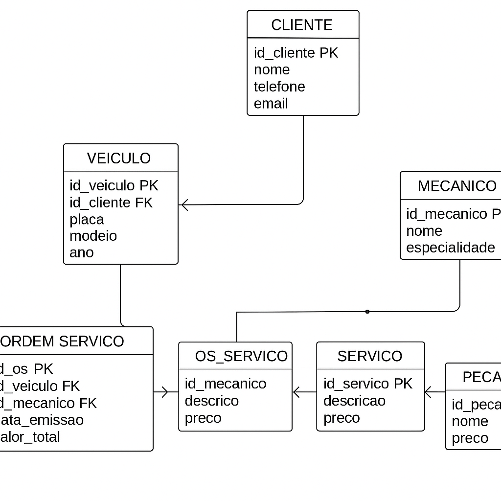

# 📌 Sistema de Oficina Mecânica

Este projeto implementa um banco de dados relacional para gerenciar uma **oficina mecânica**, permitindo o controle de clientes, veículos, ordens de serviço, mecânicos, serviços e peças.

---

## 🔧 Estrutura do Banco

O banco foi modelado em **modelo relacional**, conforme abaixo:

### Entidades Principais
- **CLIENTE**: armazena informações dos clientes.
- **VEICULO**: vinculado ao cliente.
- **MECANICO**: profissionais da oficina.
- **ORDEM_SERVICO**: representa o atendimento realizado.
- **SERVICO**: tipos de serviços disponíveis.
- **PECA**: peças utilizadas nas ordens.
- **OS_SERVICO**: associação N:N entre ordem e serviços.
- **OS_PECA**: associação N:N entre ordem e peças.

### Relacionamentos
- Um cliente pode ter **vários veículos**.
- Um veículo pode ter **várias ordens de serviço**.
- Cada ordem de serviço é atendida por **um mecânico**.
- Uma ordem pode conter **diversos serviços** e **diversas peças**.

---

## 📊 Modelo Relacional (Diagrama)

```


---

## 💾 Criação do Banco de Dados

- O script SQL de criação e inserção de dados está no arquivo [`script.sql`](script.sql).  
- Ele cria todas as tabelas e adiciona dados de teste.

---

## 🔍 Consultas SQL (Exemplos)

### 1. Listar clientes
```sql
SELECT nome, telefone FROM CLIENTE;
```

### 2. Veículos fabricados após 2015
```sql
SELECT * FROM VEICULO WHERE ano > 2015;
```

### 3. Preço das peças com imposto (atributo derivado)
```sql
SELECT nome, preco, preco * 1.10 AS preco_com_imposto
FROM PECA;
```

### 4. Ordenar mecânicos por nome
```sql
SELECT * FROM MECANICO ORDER BY nome ASC;
```

### 5. Ordens com mais de 1 peça (HAVING)
```sql
SELECT id_os, SUM(quantidade) AS total_pecas
FROM OS_PECA
GROUP BY id_os
HAVING total_pecas > 1;
```

### 6. Clientes atendidos por mecânico (JOIN)
```sql
SELECT c.nome AS cliente, v.modelo, m.nome AS mecanico, os.data_emissao
FROM ORDEM_SERVICO os
JOIN VEICULO v ON os.id_veiculo = v.id_veiculo
JOIN CLIENTE c ON v.id_cliente = c.id_cliente
JOIN MECANICO m ON os.id_mecanico = m.id_mecanico;
```

### 7. Valor total calculado da OS
```sql
SELECT os.id_os,
       SUM(s.preco * oss.quantidade) + SUM(p.preco * osp.quantidade) AS valor_total
FROM ORDEM_SERVICO os
JOIN OS_SERVICO oss ON os.id_os = oss.id_os
JOIN SERVICO s ON oss.id_servico = s.id_servico
JOIN OS_PECA osp ON os.id_os = osp.id_os
JOIN PECA p ON osp.id_peca = p.id_peca
GROUP BY os.id_os;
```

---

## 🚀 Como Executar

1. Abra o **MySQL Workbench**.  
2. Conecte no servidor MySQL.  
3. Abra o arquivo `script.sql`.  
4. Clique no **raiozinho ⚡** para criar o banco e inserir os dados.  
5. Execute as queries de exemplo para testar o banco.

---

## 📌 Autor

Desenvolvido como desafio prático de **modelagem e SQL** no contexto de uma oficina mecânica.
